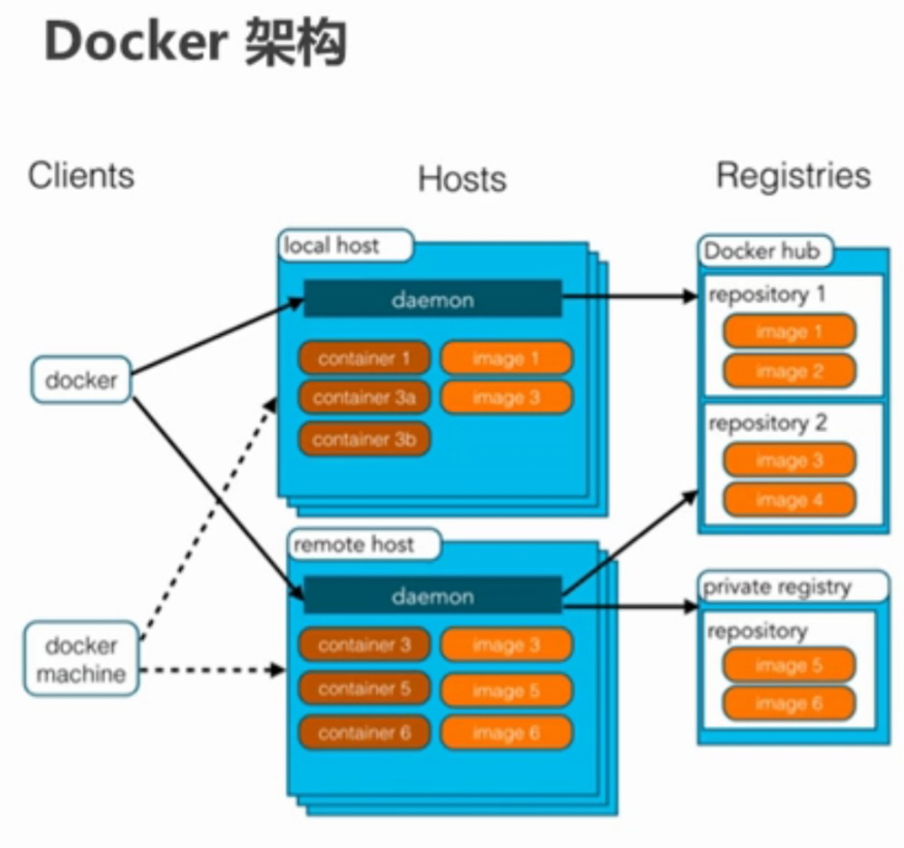

#1.初始Docker</bl>
    我们写的代码会接触到好几个环境：开发环境、测试环境以及生产环境</bl>
    比如:生产环境上你的代码是运行在JDK1.8上的能正常运行，但是测试环境的JDK是1.7导致测试人员部署你的war包后跑程序失败，
    这时你就要将你的JDK环境同war包一起传过去。将来测试人员就不用他的环境了，就在容器中测试就行了，这就规避了因为环境不同而产生的BUG了。
    而这个容器就是Docker。避免了软件跨环境迁移的问题。
 ##1.1.Docker概念
    ·Docker是一个开源的应用引擎
    ·诞生于2013年初，基于Go语言实现，dotCloud公司出品（后改名为Docker Inc）
    · Docker可以让开发者打包他们的应用以及依赖包到一个轻量级、可移植的容器中，然后发布到任何流行的Linux机器上。
    ·容器是完全使用沙箱机制，相互隔离
    ·容器性能开销极低
 小节：docker是一种容器技术，解决软件跨环境迁移的问题。
 
 ##1.2.Docker的安装
    ·①.yum包更新到最新
        yum update
    ·②.安装需要的软件包，yum.util提供yum-config-manager功能，另外两个是devicemapper驱动依赖的
        yum install -y yum-utils device-mapper-persistent-data lvm2
    ·③.设置yum源
        yum-config-manager --add-repo https://download.docker.com
    ·④.安装docker,出现输入的界面都按y
        yum install -y docker-ce
    ·⑤.查看docker版本，验证是否安装成功
        docker -v
        
 ##1.3.Docker架构
  
  ·镜像（Inamge）:Docker镜像就相当于是一个root文件系统。比如官方镜像ubuntu:16.04就包含了完整的一套Ubuntu16.04最小系统的root文件系统。
  ·容器（Container）：镜像和容器的关系，就像是面向对象程序设计中的类和对象一样，镜像是静态的定义，容器是镜像运行时的实体。容器可以被创建、启动、停止、删除、暂停等。
  ·仓库（Repository）:仓库可看成一个代码控制中心，用来保存镜像。