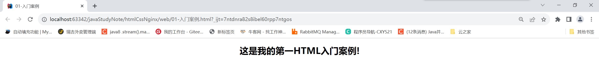
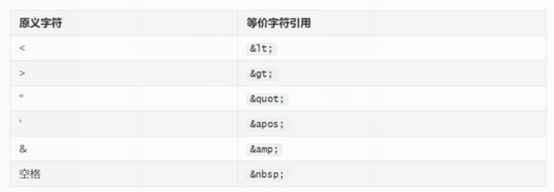
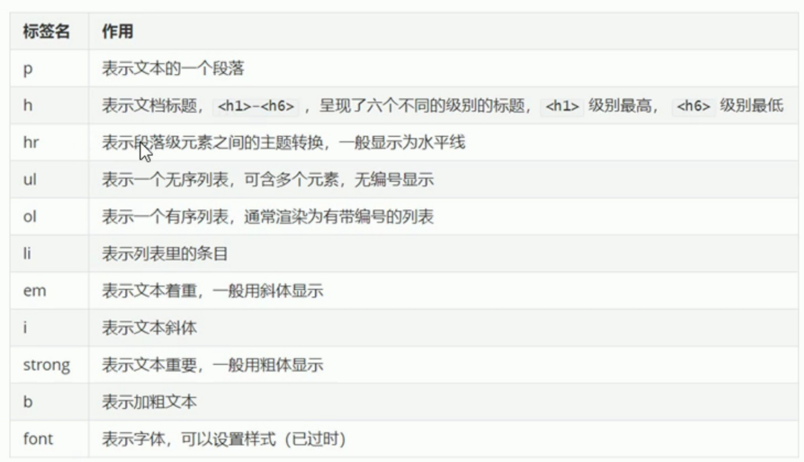

##1.HTML快速入门
    网页的介绍
    网页的构成
        ·HTML：用来制作网页基础内容和基本结构
        ·CSS：用作制作网页美化的效果
        ·JavaScript: 用来制作网页动态效果

##2.HTML的介绍
    ·HTML(HyperText Markup Language): 超文本标记语言
    ·超文本： 比普通文本更强大
    ·标记： 就是标签。可以使用一系列的标签，将网络上的文档格式统一，使分散的资源连接为一个逻辑整体
    ·2014年10月，万维网联盟宣布，经过8年时间的艰苦努力，HTML5的规范终于制作完成

##3.HTML的组成
    ·HTML页面由一系列的元素（Element）组成，而元素是通过标签创建出来的
###3.1标签 
    ·标签可以用于设置文本样式、图片样式、超链接样式等等。用<>表示
    ·例如：<h1>标签，代表一级标题。我们可以使用开始标签和结束标签包围文字，这些文字就以标题的形式显示了
###3.2属性
    ·标签中还可以拥有属性，属性可以为标签提供更多的信息。
    ·属性只能添加到开始标签中。格式为：属性名=属性值
    ·例如：align属性，代表对齐方式。我们可以在开始标签中添加该属性，就能让内容在不同位置显示了 
    <h1 align = 'center'>今天是个好日子！</h1>  

##4.HTML入门案例
·案例效果

·实现步骤
     ①.在项目下的web目录中新建一个HTML文件。
     ②.修改title标签中的内容为：01-入门案例
     ③.在<body>标签中编写一个<h1>标签，内容为：这是我的第一个HTML入门案例。
     ④.在<h1>标签中指定属性align，属性值为center。
     ⑤.通过浏览器打开查看页面

##5.页面说明
    `·<!DOCTYPE html>： H5的文档声名
     ·<html lang="en">: 根标签，一个文件中只能有一个根标签
     ·<head>: 头部标签
     ·<meta charset="UTF-8">： 设置字符集
     ·<title>： 文档标题，显示在浏览器标签上
     ·<body>： 身体标签，包含所有文档的内容
     
HTML概念小结
    ·HTML是一种标记语言，使用元素和属性来编写页面
    ·组成部分
        ·元素：开始标签、结束标签与内容相结合，便是一个完整的元素
        ·开始标签：包含元素的名称，被左、右角尖括号所包围。表示元素从这里开始或者开始起作用
        ·结束标签：与开始标签相似，只是其在元素名之前包含了一个斜杆。这表示着元素的结尾
        ·内容：元素的内容，本例中就是所输入的文本本身
        ·属性：标签的附加信息
     ·学习HTML要抓住两个重点
        ·掌握标签所代表的含义
        ·掌握在标签中属性的含义

##6.HTML基本语法
    HTML的注释
    1.什么是注释
        ·注释是用于解释说明程序的
    2.注释的格式
        ·<!-注释的内容-->
    3.注释的特点
        ·被注释掉的标签，不会被浏览器解析
    
    HTML的标签
    1.标签的分类
        ·开始和结束标签<h1></h1>  <u></u>
        ·自闭和标签    <br/>      <hr/>      
    2.标签的嵌套
        ·正确的嵌套格式：<h1><u>文本</u></h1>
        ·错误的嵌套格式：<h1><u>文本</h1></u>
    3.块级元素和行内元素
        ·块级元素：在页面中以块的形式展示，自己独占一行，后面的内容会自动换行。<p> <hr> <div>
        ·行内元素：在页面中以行的形式展现，不会换行。 <b> <i> <u> <span>
    4.div和span
        ·<div>:是一个通用的内容容器，没有特殊语义。一般用来对其它元素进行分组，用于样式化相关的需求。
        ·<span>:是一个通用的行内容器，没有特殊语义。一般被用来编织元素以达到某种样式。
        ·<div>和<span>标签核心作用是布局页面
 
##7.HTML的属性
    1.什么是属性
        ·属性可以提供一些额外的信息，这些信息不会直接显示在内容中。但可以改变标签的样式或提供数据使用
    2.定义格式
        ·属性名=属性值
    3.属性的规范
        ·同一个标签中属性的名称必须唯一
        ·不区分大小写，建议使用小写
        ·属性值可以使用单引号或双引号括起来，建议使用双引号
    4.常用的属性
        ·class:定义元素的类名，用来选择和访问特定的元素
        ·id:定义元素的唯一标识，在整个文档中必须是唯一的
        ·name；定义元素的名称，一般用于表单数据提交到服务器
        ·value：定义在元素内显示的默认值，一般常用与表单标签中
        ·style：定义元素的css样式  
     
##8.HTML的特殊字符
    1.什么是特殊字符
        ·在html中，像<> " ' 空格 &都是特殊字符，他们是语法本身的一部分


##9.HTML案例 新闻文本
想要完成这个页面，首先要进行页面的布局，然后再填充文本样式。<br>
#####1.div样式布局:<br>
    ·在head标签中通过style标签来控制样式
    ·样式格式：
```html
<style>
div{
    /*显示边框*/
    border:1px solid red;

    /*宽度 占屏幕的60%*/
    width: 60%;

    /*高度 500像素*/
heigth: 500px;

    /*边框外边距 距离浏览器的边框*/
    margin： auto;
}
</style>       
```
#####2.文本标签


图片标签
标签名：img
作用：可以显示一张图片（本地或网络）
备注：src属性，这是一个必需的属性，表示图片的地址。
      title属性，鼠标悬停时显示文本。
      alt属性：图形不显示时的替换文本。
      height属性：图像的高度。
      width属性：图像的宽度。

超链接标签
标签名：a
作用：表示超链接
备注：href属性，表示超链接指向的URL地址。
      target属性，页面的打开方式（_self当前页   _blank新标签页）。