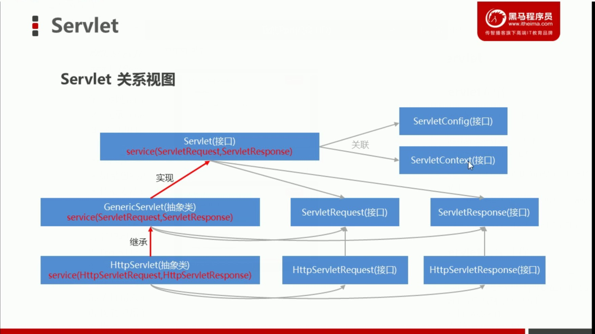

##1.HTTP协议
###1.1HTTP协议的介绍
·HTTP（Hyper Text Transfer Protocol）:超文本传输协议。 
·HTTP协议是基于TCP/IP协议的。 
·超文本：比普通文本更加强大。 
·传输协议：客户端和服务器端的通信规则（握手规则）。 

###1.2HTTP协议的请求
1.请求的组成部分 
    ①.请求行 
    ②.请求头 
    ③.请求空行 
    ④.请求体 
2.请求的方式 
    ·GET 
    ·POST 
    注意：只有POST请求方式才有请求体 

###1.3HTTP协议的响应
1.响应的组成部分 
    ①.响应行 
    ②.响应头 
    ③.响应空行 
    ④.响应体 
    
##2.静态资源案例
###2.1发布静态资源 
实现步骤 
1.创建一个JavaWEB项目。 
2.将静态页面所需资源导入到项目的web目录下。 
3.修改web.xml配置文件，修改默认主页。 
4.将项目部署到tomcat中。 
5.启动tomcat服务。 
6.打开浏览器测试查看页面。 
示例：web_test1项目 

###2.2发布动态资源
####2.2.1Servlet的介绍 
·Servlet是运行在Java服务器端的程序，用于接收和响应来自客户端基于HTTP协议的请求。 
·如果想实现Servlet的功能，可以通过实现javax.servlet.Servlet接口或者继承它的实现类。 
·核心方法：service()，任何客户端的请求都会经过该方法。 
####2.2.2实现步骤 
1.创建一个JavaWEB项目。 
2.将静态页面所需资源导入到项目的web目录下。 
3.修改web.xml配置文件，修改默认主页。 
4.在项目的src路径下编写一个类，实现Servlet接口。 
5.重写service方法，输出一句话即可。 
6.修改web.xml配置文件，配置servlet相关资源。 
7.将项目部署到tomcat中。 
8.启动tomcat服务。 
9.打开浏览器测试查看页面。 

##3.Servlet
###3.1Servlet介绍
实现servlet相关的功能有三种方法： 
①.实现servlet接口 
②.继承GenericServlet这个实现类 
③.继承HttpServlet这个实现类 

·Servlet是运行在Java服务器端的程序，用于接收和响应来自客户端基于HTTP协议的请求。 
·如果想实现Servlet的功能，可以通过实现javax.servlet.Servlrt接口或者继承它的实现类。 
·核心方法：service(),任何客户端的请求都会经过该方法。 

###3.2Servlet执行过程
1.客户端浏览器  发起请求到            Tomcat服务器 
2.Tomcat服务器  解析请求地址（URL）   也就是虚拟目录 
3.Tomca服务器   找到对应的应用 
4.找到应用的web.xml 
5.解析请求的资源地址（URI） 
6.找到应用的资源 
7.执行service方法，响应给客户端浏览器 

###3.3Servlet关系视图 
 

###3.4Servlet实现方式 
1.第一种 
    ·实现Servlet接口，实现所有的抽象方法，该方式支持最大程度的自定义。1.第一种 
2.第二种 
    ·继承GenericServlet抽象类，必须重写service方法，其他方法可选择重写。该方式让我们开发Servlet变得简单。但是这种方式和HTTP协议无关。 
3.第三种 
    ·继承HttpServlet抽象类，需要重写doGet和doPost方法，该方式表示请求和响应都需要和HTTP协议相关。 

###3.5Servlet的生命周期 
·对象的生命周期，就是对象从出生到死亡的过程。即：出生->活着->死亡。官方说法就是对象的创建到销毁的过程！ 
·出生：请求第一次到达Servlet时，对象就创建出来，并且初始化成功。只出生一次，将对象放到内存中。 
·活着：服务器提供服务的整个过程，该对象一直存在，每次都是执行service方法。 
·死亡：当服务器停止时，或者服务器宕机时，对象死亡。 

·结论：Servlet对象只会创建一次，销毁一次。所以Servlet对象只有一个实例。如果一个对象实例在应用中是唯一的存在，那么我们就称它为单例模式。 

###3.6线程安全问题    
·由于Servlet采用的是单例模式，也就是整个应用中只有一个实例对象。所以我们我们需要分析这个唯一的实例对象中的类成员是否线程安全。 
·模拟用户登录功能来查看Servlet线程是否安全。 
·结论：一个浏览器代表一个线程，多个浏览器代表多个线程。按理说我们期望的应该是每个浏览器查看的都应该是自己的用户名。而现在的结果是浏览器中数据混乱。因此，我们可以认为Servlet是线程不安全的！ 
·解决：定义类成员要谨慎。如果是公用的，并且只会在初始化是赋值，其他时间都是获取的话，那么是没有问题的。如果不是共用的，或者每次使用都有可能对其赋值，那就要考虑线程安全问题了，可以将其定义到doGet或doPost方法内或者使用同步功能即可。 

     

