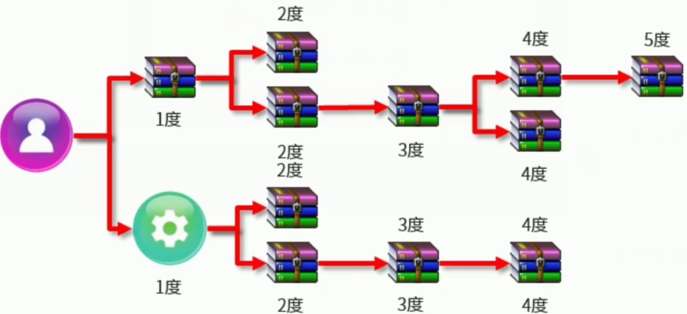
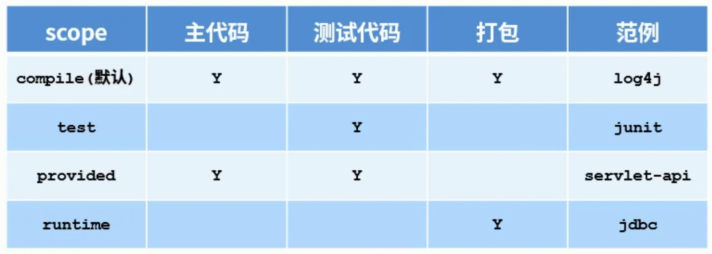
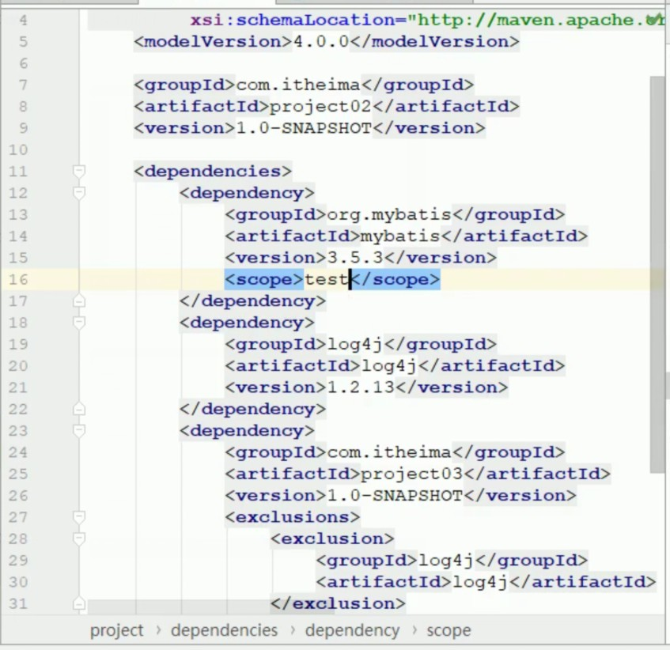
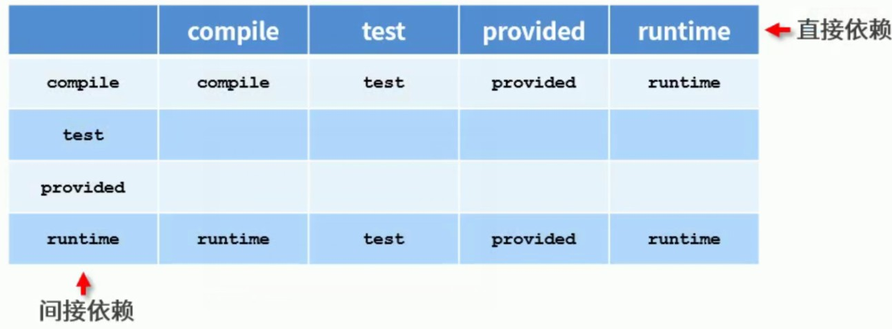

1.Maven的作用：
    项目构建：提供标准的、跨平台的自动化项目构建方式
    项目管理：方便快捷的管理项目依赖的资源（jar包），避免资源间的版本冲突问题
    统一开发结构：提供标准的、统一的项目结构

2.环境变量配置
    MAVEN_HOME=XXX/XXX
    %MAVEN_HOME%/bin
    
    查看版本:mvn -v
 
3.仓库
    ·仓库：用于存储资源，包含各种jar包
    仓库分类：
    ·本地仓库：自己电脑上存储资源的仓库，连接远程仓库获取资源
    ·远程仓库：非本机电脑上的仓库，为本地仓库提供资源
        中央仓库：Maven团队维护，存储所有资源的仓库
        私服：部门/公司范围内存储资源的仓库，从中央仓库获取资源
    ·私服的作用：
        保存具有版权的资源，包含购买或自主研发的jar
            中央仓库中的jar都是开源的，不能存储具有版权的资源
        一定范围内共享资源，仅对内部开放，不对外共享

4.坐标
    ·什么是坐标？
        Maven中的坐标用于描述仓库中的资源位置
        https://repo1.maven.org/maven2/
    ·Maven坐标主要组成
        groupId:定义当前Maven项目隶属组织名称（通常是域名反写，例如：org.mybatis）
        artifactId:定义当前Maven项目名称（通常是模块名称，例如CRM、SMS）
        version:定义当前项目的版本号
        packaging:定义该项目的打包方式

5.Maven基础概念
    本地仓库配置
        修改setting.xml文件中的<localRepository>标签。将中间的内容改为你私仓的位置。
        镜像仓库配置
            ·在用户setting文件中配置阿里云镜像仓库<mirrors>标签下添加<mirror>
    全局setting与用户setting区别
        ·全局seeting定义了当前计算器中manven的公共配置
        ·用户setting定义了当前用户的配置了 

6.依赖管理
    ·依赖指当前项目运行所需的jar，一个项目可以设置多个依赖
    ·格式：
        <!--设置当前项目所依赖的所有jar--> 
        <dependencies>
            <!-设置具体的依赖-->
            <dependency>
                <!-依赖所属群组id-->
                <groupId>junit</groupId>
                <!-依赖所属项目id-->
                <artifactId>junit</artifactId>
                <!-依赖版本号-->
                <version>4.12</version>
            </dependency>
        </dependencies>
       
依赖传递：
    现象：比如有项目一、二、三，但是项目二要用到项目三。这个时候就要想项目三作为一个资源配置到项目二。
    怎么配呢？：就是将项目三的坐标以dependency的格式放到项目二中。
    ·依赖具有传递性
        ·直接依赖：在当前项目中通过依赖配置建立的依赖关系
        ·间接依赖：被资源的资源如果依赖其他资源，当前项目间接依赖其他资源（通过依赖传递过来的）
    注意：直接依赖与间接依赖是相对的概念
    
    依赖传递冲突问题
    ·路劲优先：当依赖中出现相同的资源时，层级越深，优先级越低，层级越浅，优先级越高
    ·申明优先：当资源在相同层级被依赖时，配置顺序靠前的覆盖配置顺序靠后的
    ·特殊优先：当同级配置了相同资源的不同版本，后配置的覆盖先配置的

可选依赖
·可选依赖指对外隐藏当前所依赖的资源--不透明(optinal)
<dependency>
    <groupId>junit</groupId>
    <artifactId>junit</artifactId>
    <version>4.12</version>
    <optional>true</optional>
</dependency>

排除依赖
·排除依赖指主动断开依赖的资源，被排除的资源无需指定版本---不需要
 <dependency>
     <groupId>junit</groupId>
     <artifactId>junit</artifactId>
     <version>4.12</version>
     <exclusions>
        <exclusion>
            <groupId>org.hamcrest</groupId>
            <artifactId>hamcrest-core</artifactId>
        </exclusion>
     </exclusions>
 </dependency>  
 
 7.依赖范围（scope标签）
 ·依赖的jar默认情况可以在任何地方使用，可以通过scope标签设定其作用范围
 ·作用范围
    ·主程序范围有效（main文件夹范围内）
    ·测试程序范围有效（test文件夹范围内）
    ·是否参与打包（package指令范围内）
    
    
    
依赖范围传递性
·带有依赖范围的资源在进行传递时，作用范围将受到影响

